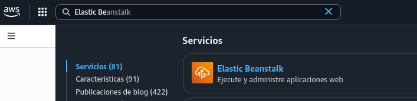
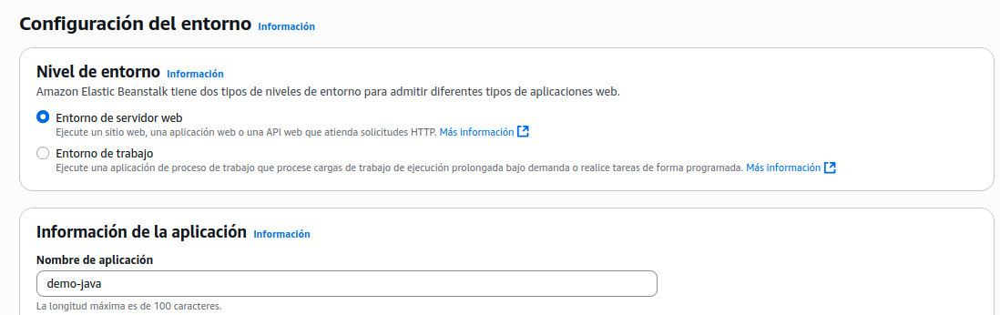
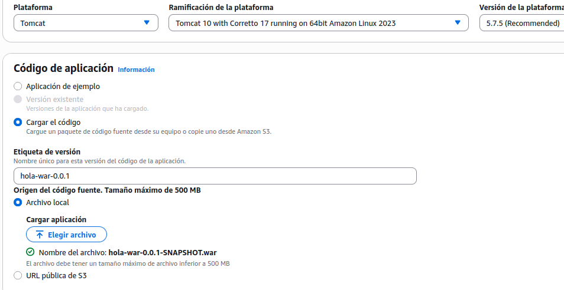
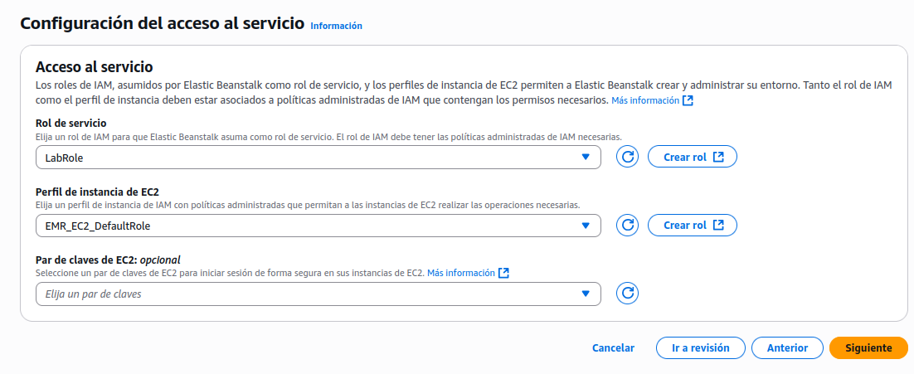

# :material-cloud-upload: Mi primer despliegue en AWS Elastic Beanstalk

En esta práctica aprenderás a publicar una aplicación Java sencilla en **Elastic Beanstalk (EB)** usando la **consola web de AWS**.  
Al final tendrás una **URL pública** con tu app en la nube. 🚀

---

## :material-flag-checkered: Objetivo
Desplegar una API **Hello** de Spring Boot sobre EB (plataforma **Java / Corretto 21**) y entender el ciclo:

➡️ **Subir → Desplegar → Probar → Limpiar**

!!! info "Duración estimada"
    ⏱️ 25–35 minutos (la primera vez).

---

## :material-format-list-checks: Requisitos 
- Archivo **`java-eb-demo.zip`**:.  
- *(Opcional)* Maven y Java 21 si quieres recompilar.

!!! tip "¿Qué hay dentro del ZIP?"
    - Un **`.jar`** ejecutable de Spring Boot.  
    - Un **`Procfile`** que indica a EB cómo arrancar la app.  

---

## :material-play-circle: Paso a paso

### :material-login-variant: 1) Acceso al servicio
1. Entra en la consola: [https://www.awsacademy.com/login](https://www.awsacademy.com/login)  
2. Busca **Elastic Beanstalk** :material-magnify:.


---

### :material-application: 2) Crear la aplicación
1. Haz clic en **Create application**.  
2. Completa los datos:  
   - **Application name** → `demo-java`  
        
   - **Plataforma** → **Java** → *Corretto 17 running on 64bit Amazon Linux 2*  
   - **Código de la aplicación** → **Cargar el código** → selecciona `java-eb-demo.zip`  
        
   - **Políticas**  → selecciona las que hay por defecto
        
   - El resto de pantallas son opcionales. Pulsa siguiente hasta llegar a la final.
3. Pulsa en **Create environment** (tipo **Web server**).

!!! note "Tiempo de espera"
    EB creará automáticamente:  
    - una instancia **EC2**  
    - un balanceador de carga  
    - grupos de seguridad y S3  
    <br>⏳ Aproximadamente 2–3 minutos.  
    <br>Continúa cuando veas **Health: OK** :material-check-circle:.

---

### :material-web: 3) Probar la aplicación
Cuando el entorno esté listo:  
- Haz clic en la **URL pública** que aparece arriba.  
- Verás el mensaje:  


Hola Mundo!


??? note "🧪 Ejercicio final: modifica, prueba en local y despliega en Elastic Beanstalk"
    # :material-flag-checkered: Objetivo
    Cambiar el texto de la app a **“Hola, <tu nombre>”**, **compilar** y **probar en local**, y finalmente **empaquetar** para **subir a Elastic Beanstalk (EB)**.

    !!! warning "¿Qué material necesitas?"
        - **Opción A (recomendada):** el **proyecto completo** (código fuente + `pom.xml`).  
          → Podrás **modificar**, **compilar** y **crear tu propio ZIP** para EB.  
        - **Opción B (limitada):** solo un **ZIP precompilado** con `Procfile` + `target/`.  
          → **No** podrás cambiar el mensaje (no hay código fuente). Pide el proyecto completo.

    ---

    ## :material-source-repository: A) Si tienes el **proyecto completo**

    ### 1) Cambia el mensaje
    Edita la clase, por ejemplo:

    ```java
    @GetMapping("/")
    public String helloWorld() {
      return "Hola, Laura!";
    }
    ```

    ### 2) Compila y prueba en local
    ```bash
    mvn clean package
    java -jar target/eb-java-demo-0.0.1-SNAPSHOT.jar
    ```

    Abre <http://localhost:8080> → debería mostrar **Hola, <tu nombre>**.

    !!! tip "¿No sabes el nombre exacto del JAR?"
        Mira qué JAR creó Maven:
        ```bash
        ls target/*.jar
        ```
        Si es distinto, úsalo en `java -jar ...`.

    ### 3) Empaqueta para Elastic Beanstalk
    Crea un ZIP con **exactamente**:
    - `Procfile` (en la **raíz** del ZIP)
    - la carpeta `target/` con tu `.jar`

    ```bash
    zip -r java-eb-demo.zip Procfile target/
    ```

    **Procfile** (en la **raíz del proyecto**):

    ```
    web: java -Dserver.port=$PORT -jar target/eb-java-demo-0.0.1-SNAPSHOT.jar
    ```

    > Si el nombre del jar cambia, actualiza esa línea, o usa esta variante robusta:

    ```
    web: bash -lc 'java -Dserver.port=$PORT -jar $(ls target/*.jar | head -n1)'
    ```

    ### 4) Sube a Elastic Beanstalk
    1. AWS Console → **Elastic Beanstalk** → tu **entorno** → **Upload and deploy**.  
    2. Sube `java-eb-demo.zip`.  
    3. Espera **Health: OK** → abre la **URL pública** → verás tu mensaje.

    ---

    ## :material-package-down: B) Si solo tienes un **ZIP precompilado**
    Con un ZIP que contiene **`Procfile` + `target/`** **no** puedes cambiar el texto: faltarían los fuentes.  
    Pide el **proyecto completo** o descarga uno de ejemplo, edítalo y sigue los pasos del apartado A.

    ---

    ## :material-playlist-check: Checklist rápido
    - [ ] Modifiqué el texto en el código fuente.  
    - [ ] Compilé: `mvn clean package` sin errores.  
    - [ ] Probé local: `java -jar target/<mi-jar>.jar` → “Hola, <mi nombre>”.  
    - [ ] Creé `java-eb-demo.zip` con **Procfile** + **target/**.  
    - [ ] Desplegué en EB y vi **Health: OK**.  

    ---

    ## :material-lifebuoy: Problemas típicos y solución

    ??? question "EB falla con 502 / Health rojo"
        - Asegúrate de que el **`Procfile`** está en la **raíz del ZIP**.  
        - Confirma que el nombre del `.jar` del `Procfile` coincide con el real.  
        - Usa la variante `bash -lc '... *.jar'` si el nombre cambia.  
        - Revisa logs en EB → **Logs → Request logs → Last 100 lines**.

    ??? question "No arranca en local"
        - Comprueba la versión de Java (`java -version`) y que el JAR existe (`ls target/*.jar`).  
        - Vuelve a compilar con `mvn clean package` y mira errores de compilación.

