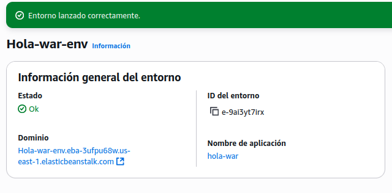
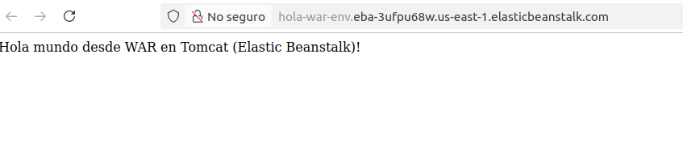

# :material-cloud-upload: Mi primer despliegue en AWS Elastic Beanstalk

En esta práctica aprenderás a publicar una aplicación Java sencilla en **Elastic Beanstalk (EB)** usando la **consola web de AWS**.  
Al final tendrás una **URL pública** con tu app en la nube. 🚀


---

## :material-flag-checkered: Objetivo
- Generar un proyecto **Spring Boot WAR**.
- Verlo **en local**.
- Empaquetar el **`.war`** y **subirlo a Elastic Beanstalk (Tomcat)**.
- Abrir la **URL pública** y comprobar el *Hola Mundo*.

!!! info "Requisitos"
    - Cuenta de AWS (Educate/Academy/Free Tier).
    - Java 17 y Maven (o wrapper `./mvnw` del proyecto).
    - Navegador web y acceso a la **Consola de AWS**.

---

## :material-download: 1) Crear el proyecto en Start.Spring.io

1. Abre <https://start.spring.io>  
2. Selecciona:
   - **Project:** Maven
   - **Language:** Java
   - **Spring Boot:** 3.x
   - **Packaging:** **War**
   - **Java:** **17**
   - **Group:** `com.example`
   - **Artifact:** `hola-war`
   - **Name:** `hola-war`
   - **Package name:** `com.example.holawar`
   - **Dependencies:** `Spring Web`
3. Pulsa **Generate** → se descargará `hola-war.zip`.

---

## :material-folder: 2) Descomprimir y abrir
Si tienes Windows puedes hacerlo con click derecho y descomprimir.

```bash
unzip hola-war.zip
cd hola-war
code .    # opcional: abre en VS Code
```

Estructura inicial (resumen):
```
hola-war/
 ├─ pom.xml
 └─ src/main/java/com/example/holawar/HolaWarApplication.java
```

---

## :material-file-plus: 3) Añadir clase Controller


### `HelloController`
Crea **`src/main/java/com/example/holawar/HelloController.java`**:

```java
package com.example.holawar;

import org.springframework.web.bind.annotation.GetMapping;
import org.springframework.web.bind.annotation.RestController;

@RestController
public class HelloController {

  @GetMapping("/")
  public String hello() {
    return "Hola mundo desde WAR en Tomcat (Elastic Beanstalk)!";
  }
}
```

---

## :material-laptop: 4) Probar en local

Usa el *wrapper* o Maven instalado:

```bash
./mvnw spring-boot:run      # macOS/Linux
# o
mvn spring-boot:run         # si tienes Maven instalado
```

Abre <http://localhost:8080> → debería verse el texto.

!!! tip "¿Por qué `spring-boot:run`?"
    Al empaquetar como **WAR** con Tomcat en *scope `provided`*, ejecutar `java -jar target/*.war` no siempre funciona. Para pruebas locales, usa `spring-boot:run`.

---

## :material-package-variant: 5) Empaquetar el `.war`

```bash
./mvnw clean package   # o: mvn clean package
```

Se genera en:

```
target/hola-war-0.0.1-SNAPSHOT.war
```

---

## :material-aws: 6) Desplegar en AWS Elastic Beanstalk (Tomcat)


1. Entra en la **Consola de AWS** → busca **Elastic Beanstalk** → **Create application**.  

2. **Application name:** `hola-war`  

3. **Platform:** **Tomcat** → *Corretto 17, Amazon Linux 2*  
4. **Application code:** **Upload your code** → sube `target/hola-war-0.0.1-SNAPSHOT.war`  

5. Roles IAM: selecciona los que aparecen por defecto en los desplegables.  

6. Las siguientes pantallas de configuración son opcionales, déjalas como están por defecto y pulsa siguiente.
7. **Create environment** (Web server).  
8. Espera a **Health: OK** y haz clic en la **URL** que muestra EB.


Deberías ver: *“Hola mundo desde WAR en Tomcat (Elastic Beanstalk)!”*



---

## :material-pencil: 7) Cambiar el mensaje y volver a desplegar

Edita `HelloController.java`:
```java
return "Hola, <tu nombre>!";
```

Compila y despliega de nuevo:
```bash
mvn clean package
# En EB → Upload and deploy → sube el nuevo .war
```

---

## :material-lifebuoy: 8) Solución de problemas

??? question "502 Bad Gateway / Health rojo"
    - Revisa que la **plataforma** es **Tomcat (Corretto 17)**, no Java SE.
    - Saca **Logs → Request logs → Last 100 lines** y mira `catalina.out` / `web.stderr.log`.

??? question "No arranca en local"
    - Usa `mvn spring-boot:run` (o `./mvnw spring-boot:run`).
    - Comprueba `java -version` = 17.

??? question "Generé con Java 21"
    - EB Tomcat usa **Corretto 17** → reconstruye el proyecto con Java **17**.

---

## :material-broom: 9) Limpieza (evitar costes)
En Elastic Beanstalk → tu entorno → **Actions → Terminate environment**.  
(Opcional: elimina la **Application** y el **bucket S3** si no la vas a reutilizar.)

---

## :material-check-bold: Checklist final
- [ ] Proyecto Spring Boot **WAR** creado con Java 17.  
- [ ] `ServletInitializer` añadido.  
- [ ] `HelloController` con `@GetMapping("/")`.  
- [ ] Probado local con `spring-boot:run`.  
- [ ] `.war` empaquetado y subido a **EB Tomcat**.  
- [ ] URL pública mostrando el *Hola Mundo*.  
