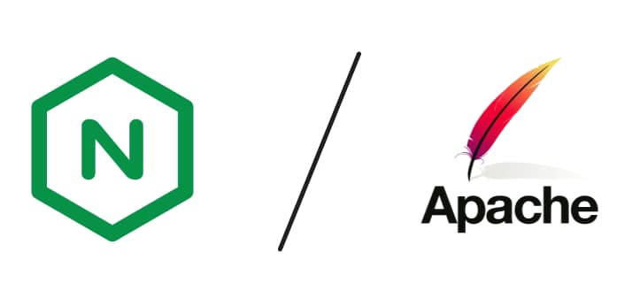
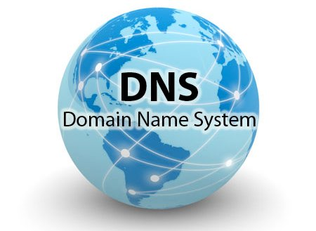
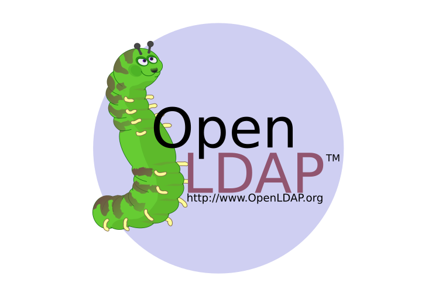

# 🧭 Resumen rápido

!!! tip "Qué veremos en este módulo"
    - **Servidores web**: instalación y configuración (Apache, Nginx).  
    - **Servidores de aplicaciones**: Tomcat y contenido dinámico.  
    - **Servicios de red**: DNS, LDAP, FTP para un despliegue real.  
    - **Contenedores**: Docker para portabilidad y aislamiento.  
    - **Control de versiones**: Git + GitHub para colaborar.  
    - **CI/CD**: automatizar integración y despliegue.  
    - **Cloud (AWS Academy)**: máquinas virtuales. 
    - **Elastic Beanstalk** para despliegue gestionado.

# 쯈ué veremos en este módulo?

En este módulo veremos distintas metodologías y tecnologías que deberemos utilizar para el despliegue de aplicaciones en entornos web.

Por un lado trataremos las técnicas y procesos esenciales para llevar a cabo la implementación exitosa de aplicaciones web en entornos de producción. Esto incluye la instalación y configuración básica de servidores web (apache, nginx) y servidores de aplicaciones (tomcat), la implantación de aplicaciones web sobre los servidores desplegados, así como la instalación y configuración de servicios de red necesarios (servidor de nombres de dominio DNS y LDAP, transferencia de ficheros mediante FTP, etc).

Puesto que hoy en día es cada vez más habitual el uso de servidores virtualizados en entornos "cloud" veremos el despliegue de todo lo anterior utilizando tecnologías de virtualización de servidores en la nube y también usando contenedores.

Otra de las partes importantes del módulo es la instalación, configuración y uso de sistemas de control de versiones en proyectos de desarrollo SW. Nosotros nos centraremos en git.

Finalmente entraremos en la metodología CI/CD (Continuous Integration/Continuous Deployment) que es un enfoque en el desarrollo de software que busca automatizar y agilizar la entrega de aplicaciones a través de un ciclo de desarrollo continuo.

Veamos cada uno de estos apartados con un poco más de detalle.

## Sistemas de control de versiones.

Un sistema de control de versiones (VCS, por sus siglas en inglés, Version Control System) es una herramienta que permite rastrear y gestionar los cambios en el código fuente y otros archivos a lo largo del tiempo. Su objetivo principal es permitir a los desarrolladores trabajar en colaboración de manera eficiente, mantener un historial de cambios y revertir a versiones anteriores si es necesario.

Actualmente, cualquier proyecto SW es imposible abordar de forma unipersonal. Los proyectos son cada vez más colaborativos y la utilización de un sistema de control de versiones ha pasado a ser una necesidad.

De entre los sistemas de control de versiones más utilizados para el desarrollo de proyectos de desarrollo se encuentra **git**. Veremos sus aspectos básicos, uso del sistema y su relación con repositorios como **github**.

{ width="600" }

## Contenedores

Entre las distintas tecnologías de virtualización existentes ha alcanzado gran relevancia en los últimos tiempos la llamada de "contenedores". De entre las distintas implementaciones de contenedores existentes nos centraremos en **docker**.

{ width="600" }

Veremos cómo docker puede ser útil a administradores de sistemas, pero también a desarrolladores. Aprenderemos los conceptos básicos de docker, a instalarlo, manejar imágenes y desplegar servicios sobre un contenedor.

## Implantación y administración de servidores web

Para poder desplegar una aplicación web lo primero que necesitaremos será un servidor web. Así pues, en primer lugar deberemos conocer qué es un servidor web y qué tecnologías de servidores web existen.

Seguidamente estudiaremos los protocolos utilizados en la transferencia de páginas web (http, https), su historia y funcionamiento.

Continuaremos viendo los servidores web más utilizados actualmente (**Apache y Nginx**), sus diferencias y aplicaciones. Los instalaremos y configuraremos.

{ width="600" }

## Servidores de aplicaciones

En sus primeros tiempos la web fue estática, es decir, el creador de las páginas web definía su contenido y los usuarios simplemente lo consultaban. Con el tiempo fueron surgiendo escenarios de interactividad creciente, en los que las páginas servidas dependían de las acciones del usuario.

Pero los servidores web habían sido desarrollados solamente para servir páginas web. Así pues, se hace necesaria la aparición de algún agente que pueda generar páginas web de forma dinámica en función de los requerimientos del usuario, y entregarlos al servidor web para servirlas. Surge así el concepto de "**servidor de aplicaciones**".

Veremos, pues, cómo funcionan este tipo de servidores y aprenderemos a instalar y configurar uno de los más utilizados **Apache Tomcat**.

{ width="600" }

## Servicios de red implicados en el despliegue de aplicaciones web

Además del propio servidor web se hacen necesarios una serie de servicios adicionales para el correcto funcionamiento del sistema. Necesitamos enviar las páginas al servidor web, traducir las **IP a los nombres de dominio**, alojar nuestro servidor en algún servicio de **hosting** accesible desde Internet...

Para enviar las páginas al servidor web aprenderemos a instalar, configurar y utilizar el **servicio FTP**.

{ width="600" }

En esta parte del módulo veremos, entre otros, el servicio **DNS o Domain Name System**. Este sistema proporciona un mecanismo eficaz para llevar a cabo la resolución de nombres de dominio a direcciones IP.  A los humanos nos es más fácil recordar un nombre de dominio (de host, de web, de servidor de correo, etc.) utilizando un texto identificativo (por ejemplo, www.gva.es) que la dirección IP pertinente (por ejemplo, 193.144.127.85).

En este apartado aprenderemos cómo funciona este sistema, los mecanismos de resolución directa e inversa, los tipos de servidores DNS (maestro, esclavo, caché, forwarder), las herramientas para utilizarlo y, como no, aprenderemos a instalar y configurar un **servidor DNS**.

{ width="600" }

Otro aspecto importante en los servidores es la gestión de usuarios y permisos de acceso a los distintos recursos. Un servidor **LDAP (Lightweight Directory Access Protocol)** es una herramienta que se utiliza para gestionar y acceder a una base de datos de información sobre usuarios y recursos en una red. Imagina un gran libro de direcciones que guarda detalles como nombres de usuario, contraseñas y permisos de acceso, y que los sistemas y aplicaciones pueden consultar para autenticar a los usuarios y autorizar su acceso a diferentes recursos. LDAP ayuda a organizar y centralizar esta información para facilitar la administración y mejorar la seguridad en una red.

Aprenderemos los conceptos básicos y a instalar y gestionar accesos mediante un servidor **OpenLDAP**.

{ width="600" }

## CI/CD (Integración y despliegue continuo)

Entre el desarrollo de una aplicación (o nueva versión de una existente) y que el usuario pueda usarla hay un paso, no trivial, la **puesta en producción**.

En las empresas tradicionales dicho proceso es muy complicado y estresante. Se hace pocas veces, cuatro o cinco veces al año, durante el fin de semana cuando todos los servicios están parados. El proceso genera muchos trastornos y dolores de cabeza. Y los resultados, muchas veces, no son los esperados.

Una idea fundamental de las **metodologías "ágiles"** es entregar valor frecuentemente para obtener una pronta retroalimentación del cliente. Para ello es necesario tener muy engrasados los procesos de despliegue y puesta en producción del software. Dentro de estas metodologías veremos CI/CD (Integración y despliegue continuo), que busca crear un proceso de desarrollo más fluido y controlado, con el objetivo de entregar software de alta calidad de manera más rápida y confiable

# 쮺칩mo lo veremos?

Cada unidad constará de una parte de teoría donde se tratarán los conceptos que son necesarios conocer antes de ponernos "manos a la obra".

Por otra parte haremos prácticas guiadas que nos permitirán instalar y configurar los distintos servicios que vayamos estudiando paso a paso siguiendo ejemplos ya preparados.

Puesto que es un objetivo del módulo la instalación y configuración básica de tecnologías de virtualización de servidores en la nube y en contenedores, empezaremos creando nuestros servicios en máquinas virtuales que crearemos en **AWS Academy (Amazon Web Services Academy)**. Allí crearemos nuestras máquinas virtuales y desplegaremos nuestros servicios.

Posteriormente pasaremos a desplegar los mismos servicios en un entorno de contenedores "**docker**", añadiendo un grado más de complejidad.

