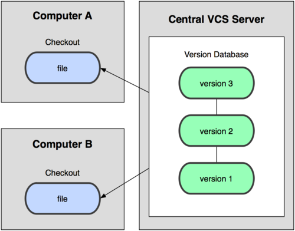

# Sistemas de control de versiones

## Definición, clasificación y funcionamiento

Se llama **control de versiones** a la gestión de los diversos cambios que se realizan sobre los elementos de algún producto o una configuración del mismo. Una **versión, revisión o edición de un producto**, es el estado en el que se encuentra dicho producto en un momento dado de su desarrollo o modificación. Aunque un sistema de control de versiones puede realizarse de forma manual, es muy aconsejable disponer de herramientas que faciliten esta gestión dando lugar a los llamados **sistemas de control de versiones o SVC (del inglés System Version Control)**.

Estos sistemas facilitan la administración de las distintas versiones de cada producto desarrollado, así como las posibles especializaciones realizadas (por ejemplo, para algún cliente específico). Ejemplos de este tipo de herramientas son entre otros: [CVS](https://www.nongnu.org/cvs/), [Apache Subversion](https://subversion.apache.org/), Ms Visual Studio Team Foundation Server, IBM ClearCase, [Darcs](https://darcs.net/), Canonical Bazaar, [Plastic SCM](https://www.plasticscm.com/), [Git](https://git-scm.com/), [Mercurial](https://www.mercurial-scm.org/), [Perforce](https://www.perforce.com/).

## Clasificación

Podemos clasificar los sistemas de control de versiones atendiendo a la arquitectura utilizada para el almacenamiento del código: locales, centralizados y distribuidos.

### Locales

Los cambios son guardados localmente y no se comparten con nadie. Esta arquitectura es la antecesora de las dos siguientes.

### Centralizados

Existe un repositorio centralizado de todo el código, del cual es responsable un único usuario (o conjunto de ellos). Se facilitan las tareas administrativas a cambio de reducir flexibilidad, pues todas las decisiones fuertes (como crear una nueva rama) necesitan la aprobación del responsable. Algunos ejemplos son CVS y Subversion.

### Distribuidos

Cada usuario tiene su propio repositorio. Los distintos repositorios pueden intercambiar y mezclar revisiones entre ellos. Es frecuente el uso de un repositorio, que está normalmente disponible, que sirve de punto de sincronización de los distintos repositorios locales. Ejemplos: Git y Mercurial.

#### Ventajas de sistemas distribuidos

- No es necesario estar conectado para guardar cambios.
- Posibilidad de continuar trabajando si el repositorio remoto no está accesible.
- El repositorio central está más libre de ramas de pruebas.
- Se necesitan menos recursos para el repositorio remoto.
- Más flexibles al permitir gestionar cada repositorio personal como se quiera.
